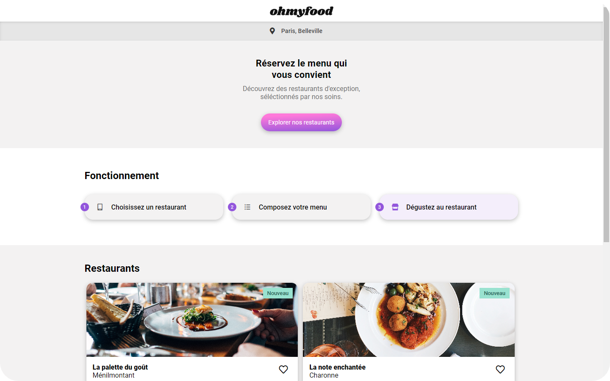

# ohmyfood

 

ohmyfood is a French gastronomy website using HTML based on a mockup, and added SCSS for animated elements.

 

	

 

## Access

* The website is online at the address : **[ohmyfood.com](https://ralexandreviegas.github.io/ohmyfood/)**.